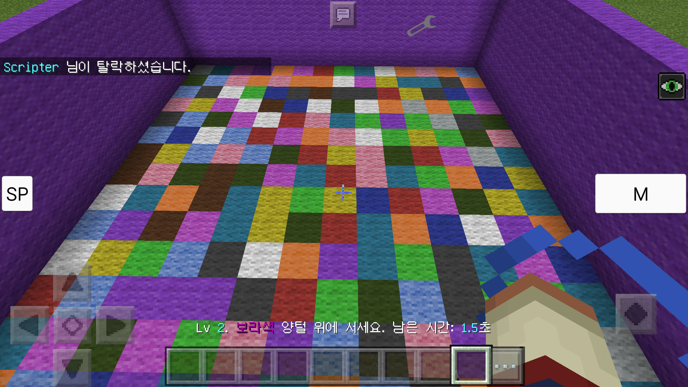

# 개요

마인크래프트 PE의 미니게임 스크립트입니다. 한국어만을 지원합니다.

# 기능

* GUI 지원

더 간편한 조작이 가능합니다.

* 미니게임 다운로드

미니게임을 게임 내에서 다운로드 할 수 있습니다.

# 미니게임

미니게임은 (블런 데이터 파일 경로)/Minigames 폴더에 다운로드 됩니다.
미니게임은 공통적으로 게임 시작 전 10초간 할 사람을 모으고,
게임 시작 후 탈락하면 관전자가 되어 플레이어를 내려다 보는 시스템을 가지고 있습니다.

# 미니게임 종류

영어명의 알파벳 순입니다.

* 모루피하기

[PVP 불가능, 블럭 캐기 불가능]
하늘에서 떨어지는 모루를 피하는 게임입니다. 모루에 맞으면 탈락합니다.

* 등반

[PVP 가능, 블럭 캐기 가능]
하늘에서 모래가 떨어지며, 이를 이용해 기반암이 있는 곳까지 올라가는 게임입니다.
모래를 캘 시 25% 확률로 눈덩이가 나오고, 5% 확률로 화염구가 나옵니다.
눈덩이는 상대방 맞춰서 떨어뜨리면 되고, 화염구로 터치하면 5초 후 폭발하며 무너집니다.

* 컬러매치

[PVP 불가능, 블럭 캐기 불가능]
바닥이 15가지 색상의 다양한 양털로 구성되며 시간이 줄어들기 시작합니다.
시간이 다 되면 채팅과 벽이 가리키는 양털을 제외하고 모두 사라지며 떨어지면 탈락입니다.
양털이 사라질 때마다 레벨이 1씩 올라가고 시간이 0.25초씩 줄어들며, 20단계가 끝입니다.

* 밀치기

[PVP 가능, 블럭 캐기 불가능]
바닥이 사과 껍질처럼 벗겨져 사라집니다. 서로를 때려 떨어뜨리세요. 떨어지면 탈락입니다.

* 런닝

[PVP 가능, 블럭 캐기 불가능]
유리를 밟으면 점차 초록색, 주황색, 빨간색이 되었다 사라집니다. 떨어지면 탈락입니다.
또한, 5초마다 랜덤한 위치에 화염구가 떨어지며 이것으로 터치 시 5 x 5가 밟혀집니다.

* 싸다구전쟁

(옛날 사진입니다. 실제와 다를 수 있습니다.)
[PVP 가능, 블럭 캐기 불가능]
[마인카우 님 아이디어입니다.]
상대방을 때리세요! 50 번을 때리면 우승입니다.

* 스플리프

[PVP 가능, 블럭 캐기 불가능]
3층의 눈 바닥 위에서 시작합니다. 눈을 부숴 상대를 떨어뜨리세요. 떨어지면 탈락입니다.

# 추가할 점

* 설정 탭

아직 아무런 기능이 없습니다. 빠질 수도

* 게임이 진행중일 시 게임 선택 탭 내용 변경

게임 강제 중단 버튼과 게임 진행 상태 메시지가 들어갈 예정입니다.

* 애드온 다운로드

현재 될 것 같이 보이신다면 속은 겁니다.

* AutoDownloader 사용

애드온 설치 안 되는 문제를 해결할 수 있을 겁니다.
